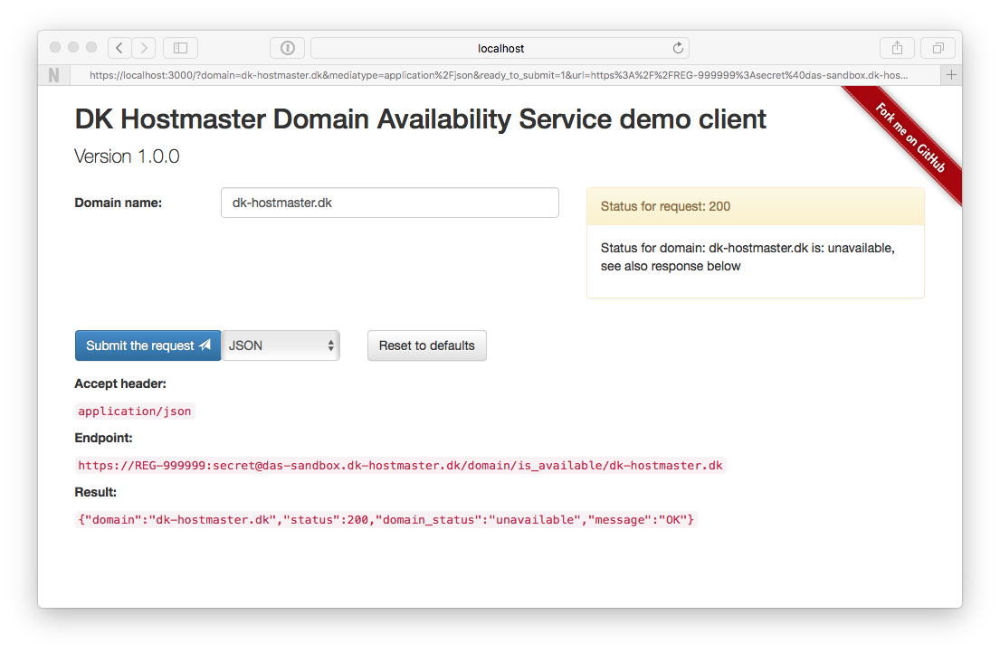

# NAME

DK Hostmaster DAS service demo client

# VERSION

This documentation describes version 1.0.0

# USAGE

    $ morbo -l https://*:3000 client.pl

Open your browser at:

    https://127.0.0.1:3000/

## Using `carton`

    $ carton

    $ carton exec -- morbo -l https://*:3000 client.pl

Open your browser at:

    https://127.0.0.1:3000/

## Using `docker`

The application can be used using `docker`

    $ docker build -t das-demo-client .

    $ docker run --rm -p 3000:3000 das-demo-client

Open your browser at:

    https://localhost:3000/

# COMPATIBILITY

Please note that the offered support for asynchronous calls (AJAX/JSONP) is not supported by the service before version 1.1.0.

# DEPENDENCIES

This client is implemented using Mojolicious::Lite in addition the following
Perl modules are used all available from CPAN.

- [Readonly](https://metacpan.org/pod/Readonly)
- [Mojo::UserAgent](https://metacpan.org/pod/Mojo::UserAgent)
- [Mojolicious::Plugin::ConsoleLogger](https://metacpan.org/pod/Mojolicious::Plugin::ConsoleLogger)

In addition to the above Perl modules, the client uses [Twitter Bootstrap](http://getbootstrap.com/) and hereby jQuery. These are automatically downloaded via CDNs and are not distributed with the client software.

# SEE ALSO

For information on the service, please refer to [the specification](https://github.com/DK-Hostmaster/das-service-specification) from DK Hostmaster or [the service main page with DK Hostmaster](https://www.dk-hostmaster.dk/en/das).

The main site for this client is the Github repository.

- https://github.com/DK-Hostmaster/das-demo-client-mojolicious

# COPYRIGHT

This software is under copyright by DK Hostmaster A/S 2014-2016

# LICENSE

This software is licensed under the MIT software license

Please refer to the LICENSE file accompanying this file.
